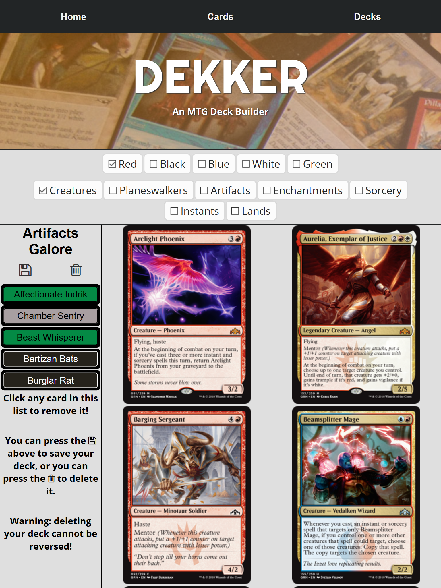
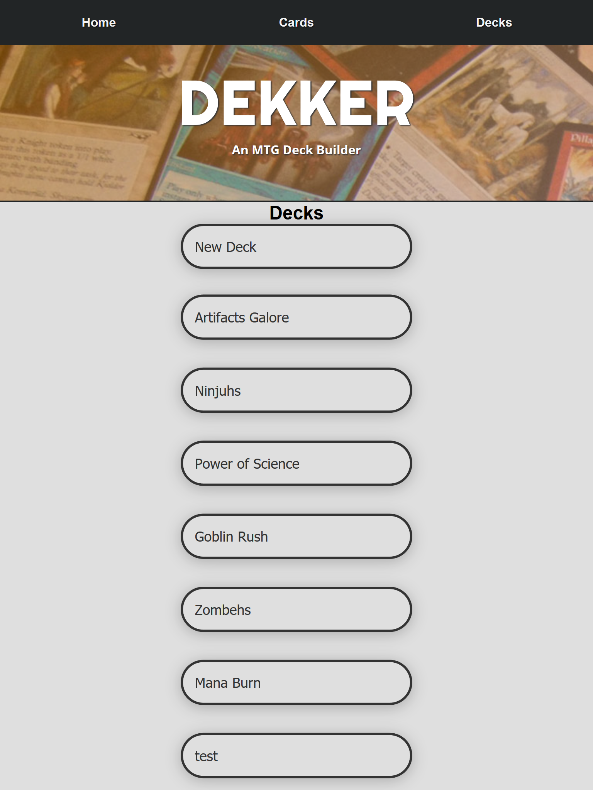

# DEKKER: An MTG Deck Builder

Dekker allows the user to create, save, edit, and delete decks of Magic: the Gathering playing cards.

Current card selection is limited to the Guilds of Ravnica pseudoblock and Core Set 2020, but in the future the entire MTG library will be available.

## Browse cards library

The current library of over 1000 cards (eventually to be the full 20k+ card library) is able to be browsed and filtered by card color and type (currently limited OR filters within each category. Exact matches to be added at a future date.) Click the "Cards" navigation button at the top of the screen from anywhere it appears to be taken back to the cards library.

## Create a deck

From either the Cards page or the Decks page the user may click the "New Deck" button and enter a deck title into the text field to create a new deck. The user will then be taken to that deck's page to edit it.

## Edit and/or delete a deck

From any given deck's page the user may edit its contents by clicking a card image on the right side of the screen to add it to the deck or clicking a card's name in the list of card names on the left to remove it from the deck. Clicking a card image multiple times will add multiple copies. Click the image of a floppy disk to save the deck's current contents and be taken to the list of decks.

Click the image of a trash can to delete the deck (this cannot be undone) (confirmation dialog to be added in the future)

## Browse list of decks already created

Click the "Decks" navigation button at the top of the screen anywhere it appears to be taken to a list of existing decks. Here you can click a deck's name to be taken to that deck's page where it can be edited or deleted, or you can click the "New Deck" button to create a new deck.

# API README

# DEKKER API for DEKKER: an MTG Deck Builder

DEKKER app available at https://dekker.app

## API url

https://dekker-api.herokuapp.com/

## END POINTS

### /api/cards

- GET request returns 20 cards in database.
  - Optional "page" query returns subsequent sets of 20 cards.

### /api/decks

- GET request eturns all decks in database.

- POST request adds a deck to the database.
  - Requires a body with a value named "title".
    - "title" must be a string.
  - Body may contain a optional value named "contents".
    - "contents" must be an array of integers corresponding to card IDs.

### /api/decks/:id

- GET request returns a specific deck by id as specified in the endpoint.

- PATCH request updates a specific deck by id as specified in the endpoint.

  - Requires body with "title" and "contents" values.
    - "title" must be a string.
    - "contents" must be an array of integers corresponding to card IDs.

- DELETE request deletes a specific deck by id as specified in the endpoint.
